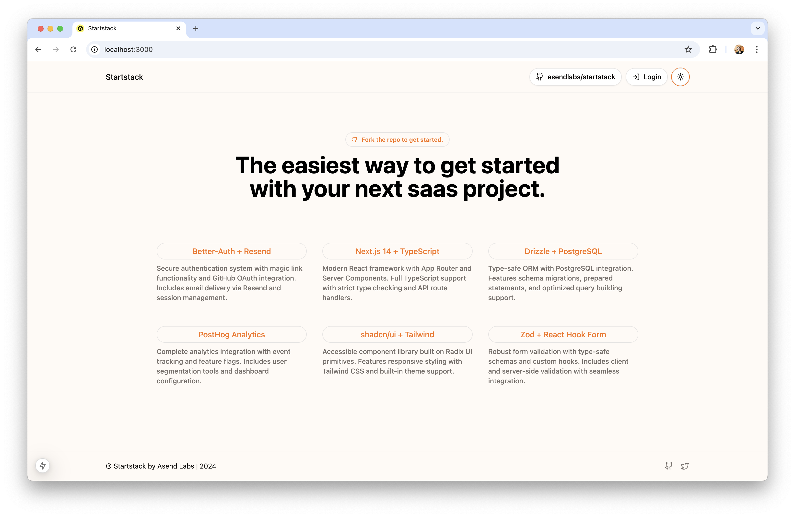

# A free commercial/personal, production-ready SaaS starter kit built with Next.js. Includes authentication, analytics, and more.

## Features

- Magic Link Auth: login with Better-Auth & Resend, plus GitHub OAuth.
- Protected Access: protected routes and middleware.
- Modern UI/UX: Tailwind CSS, dark/light mode, and dashboards.
- Type-Safe Development: TypeScript, Drizzle ORM, PostgreSQL, Zod validation.
- Analytics: PostHog integration.
- Payments (upcoming): Stripe, DodoPayments, and billing options.

## Tech Stack

- Framework: Next.js
- Authentication: Better-Auth
- Database: PostgreSQL
- ORM: Drizzle
- Styling: Tailwind CSS
- Email: Resend
- Analytics: PostHog
- Validation: Zod

## Roadmap

### Completed

- [x] Magic Link Authentication with Better-Auth and Resend
- [x] GitHub OAuth Integration
- [x] Protected Routes
- [x] User Settings
- [x] Dark/Light Mode
- [x] Dashboard & Sidebar (shadcn)
- [x] T3 Env Integration
- [x] Zod Validation
- [x] Drizzle + PostgreSQL Setup
- [x] PostHog Analytics
- [x] Landing Page

### Upcoming

- [ ] Payments (Stripe and DodoPayments integration)
- [ ] Minor fixes here and there to Improve UX & DX
- [ ] Ship v1
- [ ] Create full setup tutorial

## Contributing

1. Fork the repository.
2. Create a feature branch (`git checkout -b feature/YourFeature`).
3. Commit your changes (`git commit -m 'Add YourFeature'`).
4. Push to the branch (`git push origin feature/YourFeature`).
5. Submit a Pull Request.

For issues or feature requests, create an issue in the GitHub repository.
